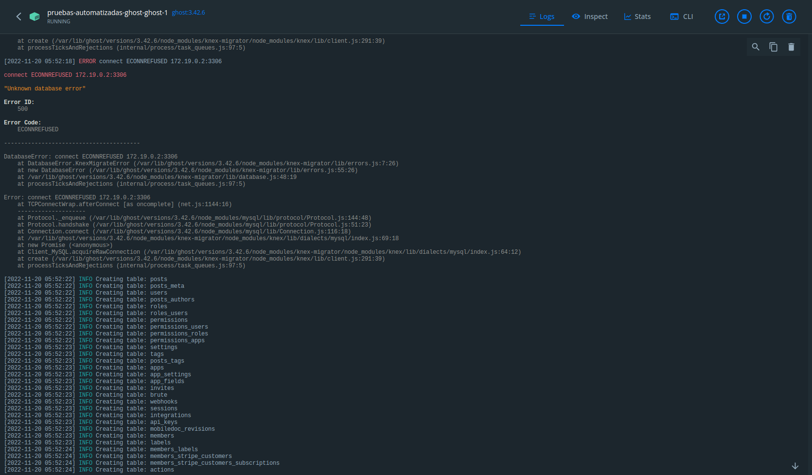

# Pruebas E2E a la plataforma GHOST

## Integrantes

| Nombre completo             | Correo Uniandes                 |
| --------------------------- | ------------------------------- |
| Juan Manuel González Garzón | jm.gonzalez1844@uniandes.edu.co |

## Detalle de las funcionalidades y escenarios probados.

### Funcionalidad 1: Configurar una marca y un usuario administrador

http://localhost:8080/ghost/#/setup

#### Escenario 1.1:

#### Escenario 1.2:

#### Escenario 1.3:

#### Escenario 1.4:

### Funcionalidad 2: Personalizar el sitio

#### Escenario 2.1:

#### Escenario 2.2:

#### Escenario 3.3:

#### Escenario 4.4:

### Funcionalidad 3: Crear un post

#### Escenario 3.1:

#### Escenario 3.2:

#### Escenario 3.3:

#### Escenario 3.4:

### Funcionalidad 4: Importar miembros a la audiencia

#### Escenario 4.1:

#### Escenario 4.2:

#### Escenario 4.3:

#### Escenario 4.4:

### Funcionalidad 5: Analizar resumenes con el dashboard.

#### Escenario 5.1:

#### Escenario 5.2:

#### Escenario 5.3:

#### Escenario 5.4:

## Instrucciones para ejecutar los escenarios

Para ejecutar los escenarios se debe primeo poner a correr una instacia de ghost local, junto con una instancia de mysql y especificar el puerto por el que se expone ghost.
Eso se puede lograr dentro de este proyecto ejecutando el comando:

### Setup de la aplicación bajo pruebas

```bash
# -g La version de ghost
# -m La version de mysql
# -p El puerto por el que se expone ghost
npm run dsetup -- -g 'x.y.z' -m 'x.y.z' -p '****'
# Ejemplo:
# Corre ghost 3.42.6 y mysql 5.7.40 exponiendo ghost en el puerto 8081
npm run dsetup -- -g '3.42.6' -m '5.7.40' -p '8081'
```

### Ejecucion de la suite de prubas especificada

Luego de eso las pruebas se corren especificando la version en prueba y el puerto donde se expone con estos comandos:

```bash
# Ejecutar la suite de pruebas de cypress
npm run test:e2e:cypress -- --env GHOST_VERSION='x.y.z',GHOST_PORT='****'
# Ejemplo
npm run test:e2e:cypress -- --env GHOST_VERSION='3.42.6',GHOST_PORT='8081'

# Ejecutar la suite de pruebas de puppeteer
npm run test:e2e:puppeteer -- 'x.y.z' '****'
# Ejemplo
npm run test:e2e:puppeteer -- '3.42.6' '8081'

# Ejecutar la suite de pruebas de playwright
npm run test:e2e:playwright -- -g 'x.y.z' -p '****'
# Ejemplo
npm run test:e2e:playwright -- -g '3.42.6' -p '8081'
```

### Teardown de la aplicación bajo pruebas

```bash
# -g La version de ghost
# -m La version de mysql
npm run dteardown -- -g 'x.y.z' -m 'x.y.z'
# Ejemplo:
# Elimina los contenedores, volumenes y redes creados para el funcionamiento de ghost 3.42.6 y mysql 5.7.40
npm run dteardown -- -g '3.42.6' -m '5.7.40'
```

### Ejecución de pruebas de regresión visual

Y finalmente despues de haber corrido los test bajo las 2 versiones de ghost se tendran almacenados los artefactos generados por las pruebas.
De esos artefactos se usaran las capturas de pantalla para ejecutar las pruebas de regresión/degradación visual.

```bash
# Ejecutar la suite de pruebas de backstop
npm run test:vrt:backstop -- -a 'a.b.c' -b 'x.y.z'
# Ejemplo
npm run test:vrt:backstop -- -a '3.42.6' -b '5.22.9'

# Ejecutar la suite de pruebas de resemble
npm run test:vrt:resemble -- -a 'a.b.c' -b 'x.y.z'
# Ejemplo
npm run test:vrt:resemble -- -a '3.42.6' -b '5.22.9'
```

### El flujo de trabajo esperado

```bash
npm run dsetup -- -g '3.42.6' -m '5.7.40' -p '8081'
# Esperar un poco (1 minuto en mi maquina), probar la url http://localhost:8081
npm run test:e2e:cypress -- --env GHOST_VERSION='3.42.6',GHOST_PORT='8081'
npm run test:e2e:puppeteer -- '3.42.6' '8081'
npm run test:e2e:playwright -- -g '3.42.6' -p '8081'
npm run dteardown -- -g '3.42.6' -m '5.7.40'

npm run dsetup -- -g '5.22.9' -m '8.0.31' -p '8082'
# Esperar un poco (1 minuto en mi maquina), probar la url http://localhost:8082
npm run test:e2e:cypress -- --env GHOST_VERSION='5.22.9',GHOST_PORT='8082'
npm run test:e2e:puppeteer -- '5.22.9' '8082'
npm run test:e2e:playwright -- -g '5.22.9' -p '8082'
npm run dteardown -- -g '3.42.6' -m '5.7.40'

# npm run test:vrt:backstop -- -a '3.42.6' -b '5.22.9'
# npm run test:vrt:resemble -- -a '3.42.6' -b '5.22.9'
```

### Consideraciones

Se debe dejar pasar un tiempo entre la puesta en pie de los contenedores y las pruebas. Ghost falla en conectarse con mysql varias veces hasta que eventualmente esta listo y pueden establecer la conexión. En mi maquina se espera 1 minuto.



## Artefactos generados de las pruebas.

Las pruebas generan evidencias graficas, principalmente capturas de pantalla pero videos también en el caso de cypress.

Las capturan de pantalla son el insumo de las pruebas de regesion visual. aqui se especifica donde pueden encontrarse y el formato de nombramiento que siguen.

## Enlace al analisis de las herramientas

[resumen de los pros y los contras de cada herramienta](https://github.com/juanmanuelgg/pruebas-e2e-ghost/wiki/Resumen-de-los-pros-y-los-contras-de-cada-herramienta)
